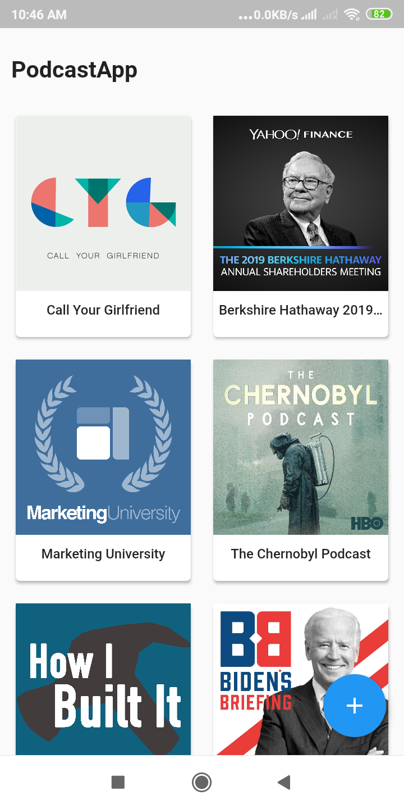
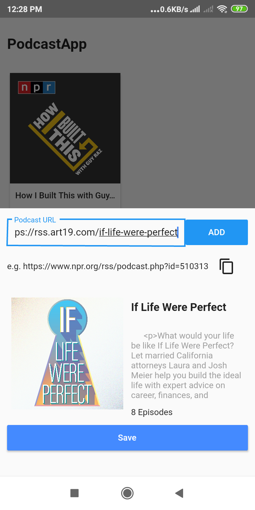
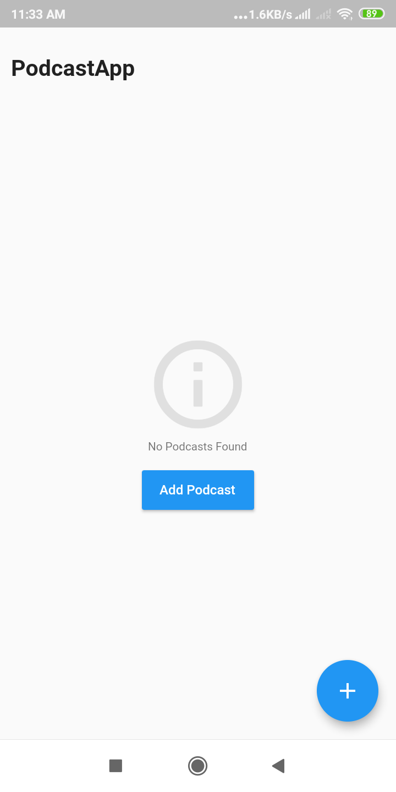

# Podcast App

A podcast application is built using flutter which let's the user save and listen their favourite podcast feed

## How to add the podcast
1. visit [listennotes.com](https://www.listennotes.com/ "listennotes.com")
2. search favourite podcast 
3. copy the rss feed link and paste into the application 

## APK link
[Generated APK](screenshots/podcastapp.apk "apk link")
## Screenshots

  
  
  
  

